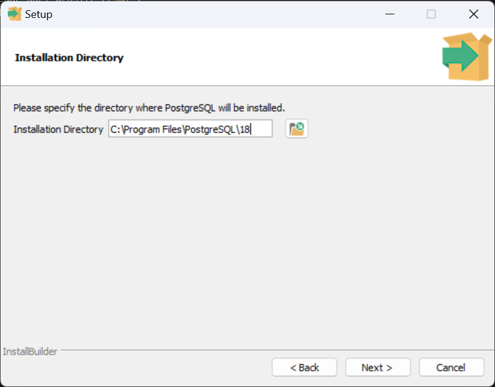
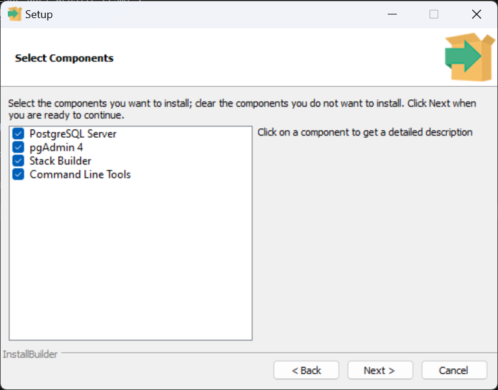
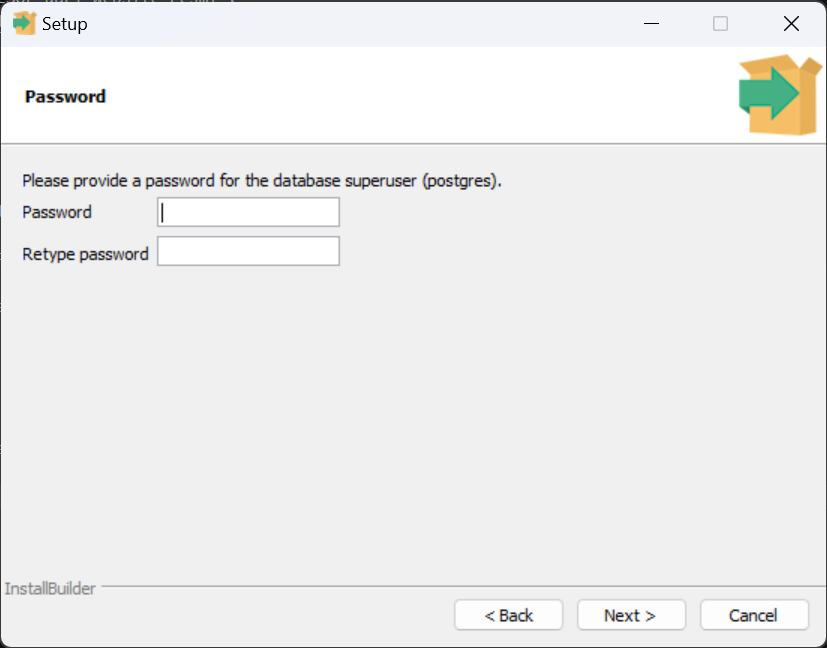
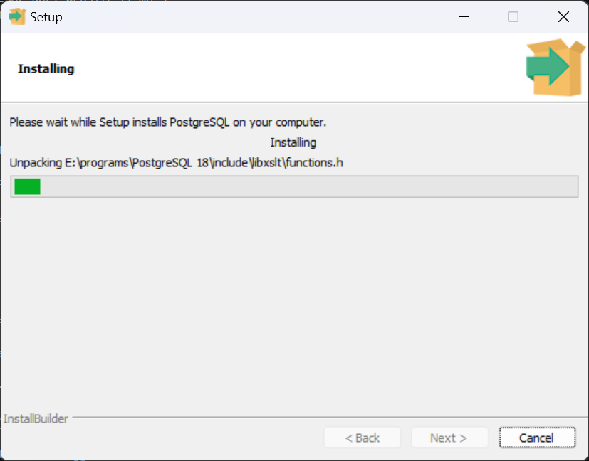
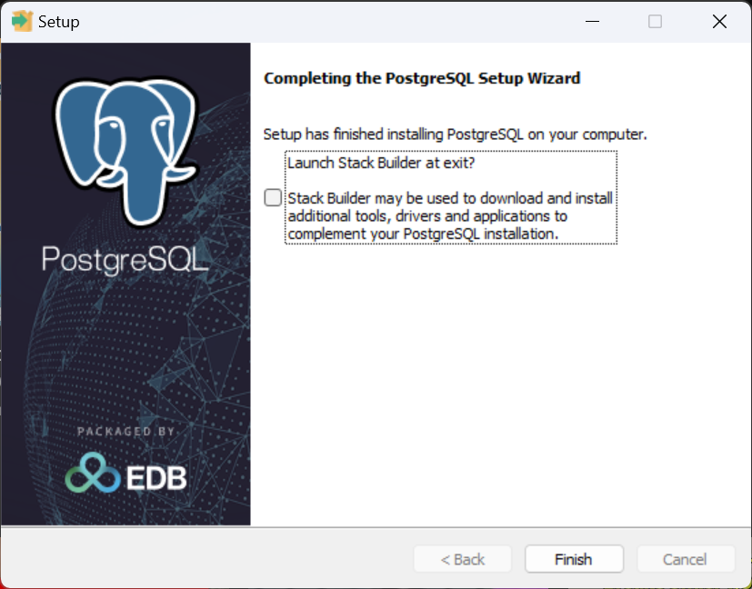
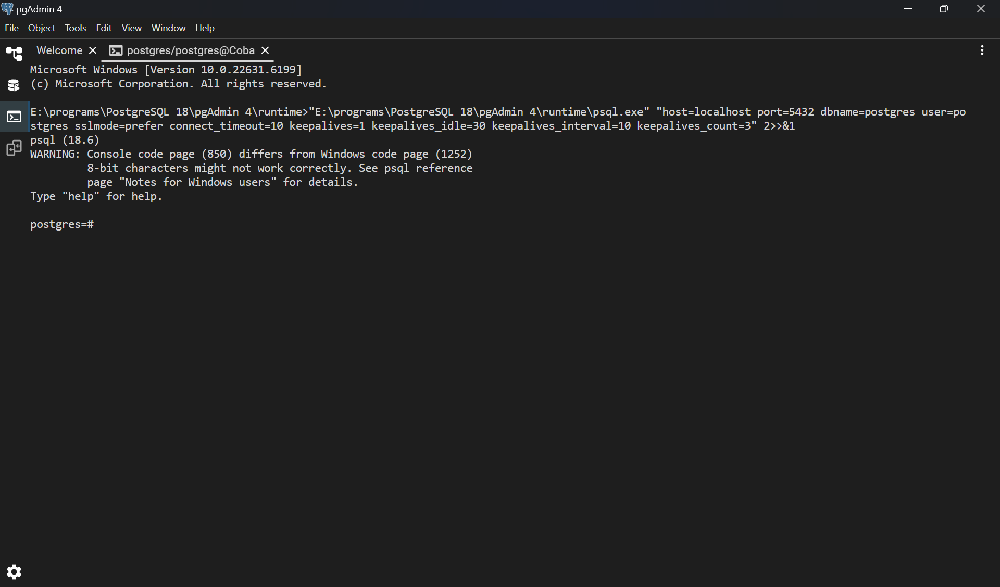

# Instalasi PostgreSQL

## Daftar Isi

- [Download PostgreSQL](#download-installer-postgresql)
- [Instalasi](#instalasi)

## Download Installer PostgreSQL

Download PostgreSQL dari website resmi :
https://www.postgresql.org/download/

Sesuaikan dengan device yang digunakan

## Instalasi

### 1. Jalankan installer yang sudah di download

Klik next

### 2. Pilih Path dimana PostgreSQL akan diinstall



Kemudian klik Next

### 3. Pastikan PostgreSQL Server dan pgAdmin tercentang



Kemudian klik next dan next (biarkan default)

### 4. Buat password untuk superuser 'postgres'

**Catat / ingat-ingat password yang dibuat. Jangan sampai lupa!**



### 5. Klik next terus hingga muncul window instalasi



Tunggu hingga selesai

### 6. Instalasi selesai

Instalasi selesai



### 7. Verifikasi pgAdmin sudah terinstall


### 8. Masuk ke menu PSQL

Isi denga konfigurasi berikut :

```
Server name     : (sesuaikan dengan keinginan)
Host name       : localhost
Port            : 5432
Database        : postgres
User            : postgres
Password        : (ketikkan password yang dibuat sebelumnya)
```

Kemudian klik **Connect & Open PSQL**

Akan muncul tampilan seperti ini



# Latihan LKP 7

```
\l

CREATE DATABASE company;

\c company;
```

### 1. Membuat table Employee

```
CREATE TABLE Employee(
    SSN CHAR(9) NOT NULL,
    FName VARCHAR(15) NOT NULL,
    MName CHAR,
    LName VARCHAR(15) NOT NULL,
    BDate DATE,
    Address VARCHAR(30),
    Sex CHAR,
    Salary DECIMAL(10,2),
    SuperSSN CHAR(9),
    DNum INT NOT NULL,
    CONSTRAINT Employee_SSN_PK PRIMARY KEY(SSN),
    CONSTRAINT Employee_DNum_FK FOREIGN KEY(DNum) REFERENCES Department(DNumber),
    CONSTRAINT Employee_SuperSSN_FK FOREIGN KEY(SuperSSN) REFERENCES Employee(SSN));
```

### 2. Membuat table Department

```
CREATE TABLE Department(
    DNumber INT NOT NULL,
    DName VARCHAR(15) NOT NULL,
    MgrSSN CHAR(9) NOT NULL,
    MgrStartDate DATE,
    CONSTRAINT Dept_DNumber_PK PRIMARY KEY(DNumber),
    CONSTRAINT Dept_DName_Unique UNIQUE(DName),
    CONSTRAINT Dept_MgrSSN_FK FOREIGN KEY(MgrSSN) REFERENCES Employee(SSN));
```

### 3. Menambah kolom pada table Employee (Constraint)

```
ALTER TABLE Employee ADD CONSTRAINT Employee_DNum_FK FOREIGN KEY(DNum) REFERENCES Department(DNumber);
```

### 4. Membuat table Dept_locations

```
CREATE TABLE Dept_Locations(
    DNum INT NOT NULL,
    DLocation VARCHAR(15) NOT NULL,
    CONSTRAINT DNumber_DLocation_PF PRIMARY KEY(DNum,DLocation),
    CONSTRAINT DLoc_DNum_FK FOREIGN KEY(DNum) REFERENCES Department(DNumber));
```

### 5. Membuat table Project

```
CREATE TABLE Project(
    PNumber INT NOT NULL,
    PName VARCHAR(15) NOT NULL,
    PLocation VARCHAR(15),
    DNum INT NOT NULL,
    CONSTRAINT Project_PNumber_PK PRIMARY KEY(PNumber),
    CONSTRAINT Project_PName_Unique UNIQUE(PName),
    CONSTRAINT Project_DNum_FK FOREIGN KEY(DNum)REFERENCES Department(DNumber));
```

### 6. Membuat table Works_on

```
CREATE TABLE Works_On(
    ESSN CHAR(9) NOT NULL,
    PNum INT NOT NULL,
    Hours DECIMAL(3,1) NOT NULL,
    CONSTRAINT Works_ESSN_PNum_PK PRIMARY KEY(ESSN,PNum),
    CONSTRAINT Works_ESSN_FK FOREIGN KEY(ESSN) REFERENCES Employee(SSN),
    CONSTRAINT Works_PNum_FK FOREIGN KEY(PNum) REFERENCES Project(PNumber));
```

### 7. Membuat table Dependent

```
CREATE TABLE Dependent(
    ESSN CHAR(9) NOT NULL,
    Dependent_Name VARCHAR(15) NOT NULL,
    Sex CHAR,
    BDate DATE,
    Relationship VARCHAR(8),
    CONSTRAINT Dependent_ESSN_DepName_PK PRIMARY KEY(ESSN,Dependent_Name),
    CONSTRAINT Dependent_ESSN_FK FOREIGN KEY(ESSN) REFERENCES Employee(SSN));
```

### 8. Cek table yang sudah ada

```
\d
```

### Insert data ke table Employee

```
INSERT INTO Employee VALUES('E001', 'Hakim', null, 'Arifin', '12-Jan-1987','BATENG', 'M', 4000000, null, 1);
INSERT INTO Employee VALUES('E002','Yuni',null,'Arti','15-Feb-1987', 'BARA','F',4000000,null,2);
INSERT INTO Employee VALUES('E003','Mutia',null,'Aziza','23-Mar-1987', 'BATENG','F',4000000,null,3);
INSERT INTO Employee VALUES('E004','Hanif',null,'Affandi','21-Jan-1987', 'BARA','M',4000000,null,4);
INSERT INTO Employee VALUES('E005','Vera',null,'Yunita','16-May-1987', 'BALEBAK','F',3500000,'E001',1);
INSERT INTO Employee VALUES('E006','Pritasri',null,'Palupiningsih','09-Dec-1987', 'BADONENG','F',3500000,'E001',1);
INSERT INTO Employee VALUES('E007','Rifki','Y','Haidar','02-Aug-1987', 'BATENG','M',3000000,'E001',1);
INSERT INTO Employee VALUES('E008','Muhammad','A','Rosyidi','22-Jun-1987', 'PERUMDOS','M',2750000,'E001',1);
INSERT INTO Employee VALUES('E009','Ferry',null,'Pratama','11-Jul-1987', 'BARA','M',3000000,'E002',2);
INSERT INTO Employee VALUES('E010','Andi',null,'Sasmita','15-Feb-1987', 'BATENG','M',3000000,'E002',2);
INSERT INTO Employee VALUES('E011','Yuhan','A','Kusuma','16-Mar-1987', 'BARA','M',2500000,'E002',2);
INSERT INTO Employee VALUES('E012','Ferdian',null,'Feisal','23-Mar-1987', 'BATENG','M',2000000,'E002',2);
INSERT INTO Employee VALUES('E013','Albertus','A','M','22-May-1986', 'BARA','M',3000000,'E003',3);
INSERT INTO Employee VALUES('E014','Benedika','F','Hutabarat','21-Jun-1987', 'BADONENG','M',3250000,'E003',3);
INSERT INTO Employee VALUES('E015','Herbet',null,'Sianipar','16-Jul-1987', 'BARA','M',3750000,'E003',3);
```

Akan muncul error, karena table Department belum ada datanya. Sehingga foreign key tidak mengacu ke data apapun

### Delete column (Tapi harus di alter lagi nanti)

```
ALTER TABLE Employee DROP CONSTRAINT Employee_DNum_FK;
```

Kemudian insert lagi data employee

### Tambah constraint lagi

```
ALTER TABLE Employee ADD CONSTRAINT Employee_DNum_FK FOREIGN KEY(DNum) REFERENCES Department(DNumber);
```

### Insert data table Department

```
INSERT INTO Department VALUES(1,'HRD','E001','09-Jan-2002');
INSERT INTO Department VALUES(2,'FINANCE','E002','27-Feb-2003');
INSERT INTO Department VALUES(3,'HUMAS','E003','30-May-2006');
INSERT INTO Department VALUES(4,'PRODUKSI','E004','08-Mar-2005');
```

Karena data table department sudah terisi, kita bisa langsung isikan data Employee ke table Employee

### Insert data table Dept_locations

```
INSERT INTO Dept_Locations VALUES(1,'Darmaga');
INSERT INTO Dept_Locations VALUES(3,'Darmaga');
INSERT INTO Dept_Locations VALUES(2,'Darmaga');
INSERT INTO Dept_Locations VALUES(4,'Baranang Siang');
```

### Insert data table Project

```
INSERT INTO Project VALUES(1,'AAA','Bogor',1);
INSERT INTO Project VALUES(2,'BBB','Jakarta',2);
INSERT INTO Project VALUES(3,'CCC','Tangerang',2);
INSERT INTO Project VALUES(4,'DDD','Bekasi',2);
INSERT INTO Project VALUES(5,'EEE','Depok',3);
INSERT INTO Project VALUES(6,'FFF','Bogor',3);
INSERT INTO Project VALUES(7,'GGG','Tangerang',4);
INSERT INTO Project VALUES(8,'HHH','Jakarta',4);
```

### Insert data Works_on

```
INSERT INTO Works_On VALUES('E001',1,90);
INSERT INTO Works_On VALUES('E001',2,98);
INSERT INTO Works_On VALUES('E002',2,55);
INSERT INTO Works_On VALUES('E002',3,78);
INSERT INTO Works_On VALUES('E003',3,53);
INSERT INTO Works_On VALUES('E003',4,77);
INSERT INTO Works_On VALUES('E004',4,77);
INSERT INTO Works_On VALUES('E004',5,98);
INSERT INTO Works_On VALUES('E004',7,85);
INSERT INTO Works_On VALUES('E004',8,68);
INSERT INTO Works_On VALUES('E005',5,57);
INSERT INTO Works_On VALUES('E005',6,87);
INSERT INTO Works_On VALUES('E006',7,45);
INSERT INTO Works_On VALUES('E006',6,87);
INSERT INTO Works_On VALUES('E007',7,40);
INSERT INTO Works_On VALUES('E007',8,88);
INSERT INTO Works_On VALUES('E008',1,78);
INSERT INTO Works_On VALUES('E008',8,87);
INSERT INTO Works_On VALUES('E009',1,88);
INSERT INTO Works_On VALUES('E009',2,65);
INSERT INTO Works_On VALUES('E010',2,34);
INSERT INTO Works_On VALUES('E010',3,78);
INSERT INTO Works_On VALUES('E011',1,68);
INSERT INTO Works_On VALUES('E011',3,88);
```

### Insert data table Dependent

```
INSERT INTO Dependent VALUES('E001','Rita','F','18-Sep-2005','DAUGHTER');
INSERT INTO Dependent VALUES('E001','Doni','M','09-Jan-2007','SON');
INSERT INTO Dependent VALUES('E002','Wawan','M','23-Oct-1984','HUSBAND');
INSERT INTO Dependent VALUES('E002','Roy','M','15-Dec-2006','SON');
INSERT INTO Dependent VALUES('E003','Roni','M','23-AUG-1985','HUSBAND');
INSERT INTO Dependent VALUES('E003','Dewi','F','01-Jan-2006','DAUGHTER');
INSERT INTO Dependent VALUES('E004','Susi','F','05-Sep-1987','WIFE');
INSERT INTO Dependent VALUES('E004','Rani','M','10-Feb-2007','DAUGHTER');
INSERT INTO Dependent VALUES('E011','Dina','F','13-Jan-1987','WIFE');
INSERT INTO Dependent VALUES('E011','Riko','M','21-Mar-2006','SON');
INSERT INTO Dependent VALUES('E013','Rini','F','15-Aug-1987','WIFE');
INSERT INTO Dependent VALUES('E013','Tina','F','17-Dec-2005','DAUGHTER');
INSERT INTO Dependent VALUES('E014','Ayu','F','08-Dec-1988','WIFE');
INSERT INTO Dependent VALUES('E014','Didiet','M','05-Dec-2006','SON');
INSERT INTO Dependent VALUES('E020','Nita','F','25-Jan-1987','WIFE');
```

## UPDATE

```
SELECT * FROM Employee;
```

```
UPDATE Employee SET Salary = 5000000 WHERE Address= ‘BARA’;
```

Kita lihat perbedaannya,

```
SELECT * FROM Employee;
```

## DELETE

```
DELETE FROM Employee WHERE Address=’PERUMDOS’;
SELECT * FROM Employee;
```

## Data Manipulation Language

```
SELECT SSN, FName, LName, BDate FROM
Employee
WHERE FName LIKE ’H%’;
```

Akan mengembalikan data dengan FName berawalan huruf 'H'

```DML
LIKE ’A%’       : dimulai dengan karakter ’A’
LIKE ’%A%’      : terdiri dari karakter ’A’
LIKE ’_A%’      : ada karakter ’A’ di posisi kedua
LIKE ’A%i%’     : dimulai dengan karakter ’A’ dengan mengadung karakter ’I’
LIKE ’A%i%o’    : dimulai dengan karakter ’A’, mengandung karakter ’i’, lalu karakter ’o’
NOT LIKE ’A%’   : dimulai bukan dengan karakter ’A’
```

## CASE

untuk menentukan conditional dari hasil query.

```
SELECT SSN, FName, Salary,
    CASE
    WHEN Salary > 3500000 THEN ’Top’
    ELSE ’Middle’
    END AS Level
FROM Employee
ORDER BY SSN;
```

## Aggregate Function

```
SUM(nama_kolom)     : total dari nilai kolom
MAX(nama_kolom)     : nilai terbesar dari suatu kolom
MIN(nama_kolom)     : nilai terkecil dari suatu kolom
AVG(nama_kolom)     : nilai rata-rata dari suatu kolom
COUNT(*)            : banyaknya nilai dari tabel yang tidak berulang
COUNT(nama_kolom)   : banyaknya nilai dari suatu kolom yang tidak berulang
```

```
SELECT MAX(Salary), MIN(Salary), AVG(Salary) FROM Employee;
SELECT COUNT(SSN) AS Jumlah_Employee_di_BARA FROM Employee WHERE Address = ’BARA’;
SELECT COUNT(DISTINCT PLocation) AS ”distinct lokasi”, COUNT(PLocation) AS ”total lokasi” FROM Project;
```

## GROUP BY dan ORDER BY

- **GROUP BY** -> mengelompokan aggregate functions berdasarkan kolom tertentu.
- **ORDER BY** -> mengurutkan hasil query berdasarkan kolom tertentu, ASC untuk menaik, DESC untuk menurun.

```
SELECT Dnum, Min(Salary), MAX(Salary), AVG(Salary) FROM Employee
GROUP BY DNum
ORDER BY DNum DESC;
```

## HAVING

melakukan query pada kolom yang memiliki nilai tertentu.

```
SELECT Address, COUNT(*) FROM Employee
GROUP BY Address
HAVING COUNT(*) > 4
ORDER BY Address;
```

## Magic Variable

```
CURRENT_DATE        : untuk menentukan tgl terbaru
CURRENT_TIME        : untuk menentukan waktu terbaru
CURRENT _TIMESTAMP  : untuk memberikan penanda waktu terbaru
CURRENT_USER        : untuk memberikan user database terbaru
```

```
SELECT CURRENT_USER, CURENT_DATE, CURRENT_TIME, CURRENT_TIMESTAMP;
SELECT SSN, FName, Age(CURRENT_DATE, BDate) AS Age FROM Employee ORDER BY Age ASC;
```
